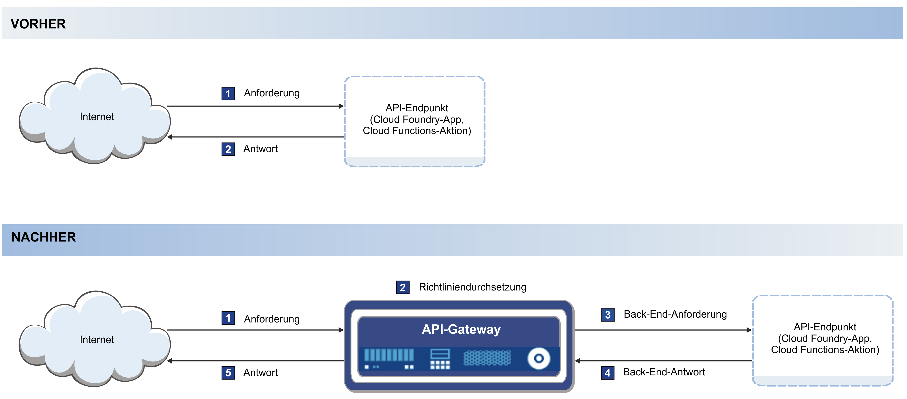

---

copyright:
  years: 2017,2018
lastupdated: "2018-07-02"

---

{:new_window: target="_blank"}
{:shortdesc: .shortdesc}
{:screen: .screen}
{:codeblock: .codeblock}
{:pre: .pre}

# Übersicht
{: #index}

APIs können nativ in {{site.data.keyword.Bluemix}} verwaltet werden. Dabei spielt es keine Rolle, ob sie einer Cloud Foundry-Laufzeit, einer {{site.data.keyword.openwhisk_short}}-Aktion oder einer wachsenden Liste integrierter {{site.data.keyword.Bluemix_notm}}-Services, wie beispielsweise dem {{site.data.keyword.appconserviceshort}}-Service, zugeordnet sind. Durch das Verwalten der APIs kann die Nutzung gesteuert und die Akzeptanz erhöht werden. Ferner ist es möglich,Statistiken zu überwachen.

API-Management ist in den folgenden {{site.data.keyword.Bluemix_notm}}-Services integriert:
* Cloud Foundry-Anwendungen
* IBM App Connect
* APIs für {{site.data.keyword.openwhisk_short}}-Aktionen

Das folgende Diagramm zeigt, wie das API-Management durch Einfügen eines schnellen und einfachen Gateways funktioniert. Das Gateway, das im Diagramm als API-Gateway bezeichnet wird, antwortet auf eingehende API-Aufrufe von Anwendungen. Das API-Gateway stellt eine umfassende Reihe von API-Richtlinien für Sicherheit, Datenverkehrsmanagement, Mediation, Beschleunigung und Nicht-HTTP-Protokoll-Unterstützung bereit.

Wenn Sie eine API verfügbar machen, kann diese API von anderen Benutzern verwendet werden. Dabei erhalten die Benutzer der API häufig eingeschränkten Zugriff auf die Informationen, die sich auf den verwalteten Servern befinden. Dies führt zu einer höheren Benutzerfreundlichkeit für den Endbenutzer, da der Zugriff auf die Informationen direkt über die aktuelle Schnittstelle erfolgt.

Manchmal kann es notwendig sein, gewisse Aktivitäten auf den Servern zu steuern. Wenn auf einem Server beispielsweise zu viele API-Anforderungen in einem kurzen Zeitraum erfolgen, kann es zu einer Überlastung des Servers kommen, der daraufhin beendet wird. Um Situationen wie diese zu vermeiden, kann die Quote der API-Aufrufe über das API-Management gesteuert werden. Das der API zugeordnete einfache Gateway überwacht die Anzahl der API-Aufrufe und schränkt die Anzahl der akzeptierten Aufrufe ein. Ferner kann mithilfe des API-Managements die Menge der API-Aufrufe einer bestimmten Quelle durch Aufzeichnung des zugehörigen API-Schlüssels überwacht werden. Der API-Schlüssel ist eine eindeutige Zeichenfolge, die das API-Entwicklerteam dem API-Verbraucherteam zur Verfügung stellt und dem API-Entwickler die Überwachung von Statistiken zu den Aufrufen ermöglicht, die von den Anforderungen des Verbraucherteams generiert werden.  

Das API-Management von {{site.data.keyword.Bluemix_notm}} bietet die folgenden Funktionen:
## API-Analyse
{: #basic_analytics notoc}

Sollen APIs gewinnbringend genutzt werden, können Sie mithilfe der Analysefunktion die Aufrufnutzung überwachen. Ferner erhalten Sie Aufschluss über die Art der API-Nutzung, um fundierte Entscheidungen hinsichtlich der Frage zu treffen, wie die APIs für eine höhere Akzeptanz aktualisiert werden sollten.

Die folgenden Statistiken zu APIs können angezeigt werden:
* Die Anzahl der Antworten und die durchschnittliche Antwortzeit in der letzten Stunde oder im angegebenen Zeitintervall.
* Die Anzahl der API-Aufrufe pro Minute.
* Die letzten 100 Antworten.

API-Management verwendet die {{site.data.keyword.Bluemix_notm}} Protokollierungs- und Metrikenservices, um Informationen, die während der API-Aufrufe generiert werden, zu speichern und anzuzeigen. In der API-Managementkonsole für Fehlerbehebungszwecke wird nur eine Untergruppe der verfügbaren Daten dargestellt. Zum Anzeigen zusätzlicher Daten und Protokollinformationen, ziehen Sie den Abschnitt [Kibana-Protokolle ](https://logging.ng.bluemix.net/app/#/kibana5){: new_window} zu Rate. Sie müssen an Ihrem {{site.data.keyword.Bluemix_notm}}-Konto angemeldet sein, damit sich der Link zu Ihrem Konto korrekt auflöst. Weitere Informationen zu den {{site.data.keyword.Bluemix_notm}}-Protokollierungsservices finden Sie im Abschnitt [Überwachung und Protokollierung](../cli/monitoring_logging.html#monitoring_logging){: new_window}.

## Ratenbegrenzung durch Subskription (API-Schlüssel)
{: #rate_limit notoc}

Sie können eine Ratenbegrenzung festlegen, um die Anzahl der API-Aufrufe durch Anwendungen zu steuern. Im Falle einer Ratenbegrenzung kann nur eine bestimmte Anzahl von Aufrufen pro Sekunde, Minute oder Stunde erfolgen, sodass Ihr Back-End nicht überlastet wird. Sie können diese Rate so festlegen, dass sie allgemein für die API gilt, oder aber eine einzelne Begrenzung für die API definieren, die für jeden einzelnen API-Schlüssel gilt. Weitere Informationen zu Schlüsseln und geheimen Schlüsseln finden Sie in [API-Einstellungen bearbeiten](manage_apis.html#settings_apis).

## OAuth
{: #oauth notoc}

Um eine unzulässige Nutzung der bereitgestellten Daten zu verhindern, können Sie sicherstellen, dass nur Benutzer mit einer korrekten Authentifizierung auf die APIs zugreifen können. Der API-Zugriff kann über den OAuth-Autorisierungsstandard gesteuert werden. OAuth ist ein tokenbasiertes Berechtigungsprotokoll, das Websites anderer Anbieter oder Anwendungen den Zugriff auf Benutzerdaten ermöglicht, ohne dass der Benutzer persönliche Daten preisgeben muss.

## CORS
{: #cors notoc}

CORS ermöglicht den in einer Webseite eingebetteten Scripts domänenübergreifende API-Aufrufe. Der Vorteil für den API-Benutzer besteht darin, dass die API die Informationen aus einer anderen Domäne abrufen kann, wenn diese von der API aufgerufen wird. Ohne die Aktivierung von CORS ist das Abrufen von Inhalten auf die Domäne der ursprünglichen Anforderung begrenzt. Weitere Informationen zu CORS sowie zur Implementierung finden Sie in [Cross-Origin Resource Sharing (CORS) ](https://developer.mozilla.org/en-US/docs/Web/HTTP/CORS){: new_window}.

## Zusätzliche Optionen für das API-Management
{: #add_mgt_options notoc}

Diese Funktionen für das API-Management können über die Registerkarte 'API-Management' des Cloud Foundry-, {{site.data.keyword.openwhisk_short}}- oder App Connect-Dashboards aufgerufen werden. Für komplexere Verwaltungslösungen ist ein Upgrade auf den vollständigen {{site.data.keyword.apiconnect_full}}-Service möglich. Weitere Informationen zum {{site.data.keyword.apiconnect_full}}-Service finden Sie in
[Getting started with API Connect](https://console.ng.bluemix.net/docs/services/apiconnect/index.html){: new_window}.

Weitere Informationen zum Upgrade der in {{site.data.keyword.Bluemix_notm}} verwalteten APIs auf den {{site.data.keyword.apiconnect_short}}-Service finden Sie in [Auf weitere Funktionen des API-Managements zugreifen](upgrade.html).
