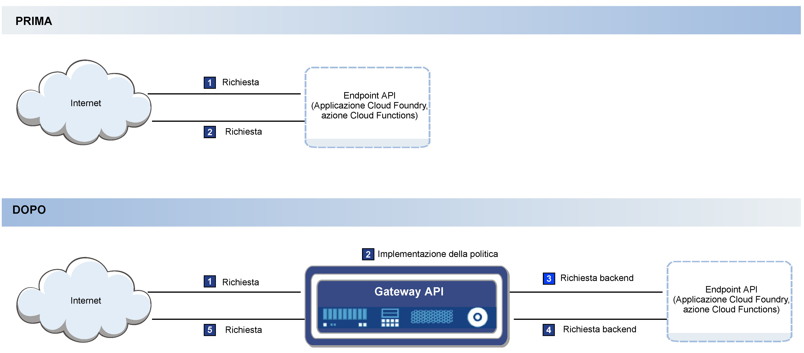

---

copyright:
  years: 2017,2018
lastupdated: "2018-07-02"

---

{:new_window: target="_blank"}
{:shortdesc: .shortdesc}
{:screen: .screen}
{:codeblock: .codeblock}
{:pre: .pre}

# Panoramica
{: #index}

Puoi gestire le API in modo nativo in {{site.data.keyword.Bluemix}} sia che siano associate a un qualsiasi runtime Cloud Foundry, a un'azione {{site.data.keyword.openwhisk_short}} o a un elenco crescente di servizi {{site.data.keyword.Bluemix_notm}} integrati come ad esempio il servizio {{site.data.keyword.appconserviceshort}}. La gestione delle API ti consente di controllare l'utilizzo, aumentare l'adozione e tenere traccia delle statistiche.

La gestione delle API è integrata nei seguenti servizi {{site.data.keyword.Bluemix_notm}}:
* Applicazioni Cloud Foundry
* IBM App Connect
* API di azioni {{site.data.keyword.openwhisk_short}}

Come visualizzato nel seguente diagramma, Gestione delle API funziona inserendo un gateway leggero e veloce davanti agli endpoint cloud esistenti. Il gateway, a cui si fa riferimento come Gateway API nel diagramma, è responsabile della risposta alle chiamate API in entrata dalle applicazioni. Il Gateway API fornisce un insieme completo di politiche API per la sicurezza, la gestione del traffico, la mediazione, l'accelerazione e il supporto di protocolli non HTTP.

Quando esponi una API, la rendi disponibile per l'uso agli altri utenti. Questo spesso significa dare agli utenti della API un accesso limitato alle informazioni presenti sui server da te gestiti. Questo accesso consente un'esperienza cliente più fluida per gli utenti finali perché possono accedere alle informazioni direttamente dall'interfaccia corrente.

In alcuni casi, potresti voler controllare parte dell'attività sui tuoi server. Ad esempio, se ci sono troppe richieste API su un server in un breve lasso di tempo, il server potrebbe sovraccaricarsi e arrestarsi. Per evitare una situazione del genere, puoi gestire la frequenza di chiamate API utilizzando Gestione delle API. Il leggero gateway collegato alla API traccia il numero di chiamate alla tua API e implementa dei limiti al numero di chiamate che accetta. Gestione delle API ti consente anche di tenere traccia del volume di chiamate API da una specifica origine registrandone la chiave API. La chiave API è una stringa univoca che il team di sviluppo dell'API fornisce al team di utilizzo dell'API che consente allo sviluppatore dell'API di monitorare le statistiche sulle chiamate che le richieste del team di utilizzo stanno generando.  

Con la gestione delle API {{site.data.keyword.Bluemix_notm}} sono disponibili le seguenti funzioni:
## Analisi API
{: #basic_analytics notoc}

Se vuoi monetizzare l'uso delle tue API, puoi utilizzare la funzione di analisi per tenere traccia dell'utilizzo di chiamate. Puoi anche monitorare l'utilizzo per comprendere in che modo vengono utilizzate le tue API in modo da poter prendere delle decisioni informate su come aggiornare le tue API per aumentare l'adozione.

Puoi visualizzare le seguenti statistiche sulle tue API:
* Il numero di risposte e il tempo di risposta medio nell'ultima ora oppure nell'intervallo di tempo da te specificato.
* Il numero di chiamate API al minuto.
* Le ultime 100 risposte.

Gestione delle API utilizza i servizi di metriche e registrazione di {{site.data.keyword.Bluemix_notm}} per memorizzare e visualizzare le informazioni che vengono generate durante le chiamate all'API. Solo un sottoinsieme dei dati disponibili viene presentato nella console di gestione API per scopi di debug. Per visualizzare ulteriori informazioni su dati e log, vedi i [log Kibana ](https://logging.ng.bluemix.net/app/#/kibana5){: new_window}. Devi accedere al tuo account {{site.data.keyword.Bluemix_notm}} affinché il link venga risolto correttamente nel tuo account. Per ulteriori informazioni sui servizi di registrazione {{site.data.keyword.Bluemix_notm}}, vedi [Monitoraggio e registrazione](../cli/monitoring_logging.html#monitoring_logging){: new_window}.

## Limitazione della frequenza in base alla sottoscrizione (chiave API)
{: #rate_limit notoc}

Puoi implementare un limite della frequenza per gestire il numero di chiamate che le applicazioni possono fare alle tue API. Puoi specificare un limite della frequenza in modo che venga effettuato solo un numero di chiamate consentito al secondo, minuto od ora, in modo che, ad esempio, il tuo backend non venga sovraccaricato. Puoi impostare questa frequenza all'API nella sua globalità oppure impostare un solo limite per l'API che si applica ad ogni chiave dell'API individualmente. Per ulteriori informazioni sulle chiavi e sui segreti, consulta [Modifica delle impostazioni di una API](manage_apis.html#settings_apis).

## OAuth
{: #oauth notoc}

Per impedire un utilizzo indesiderato dei dati da te forniti, puoi garantire che solo gli utenti con l'autenticazione corretta possano accedere alle tue API. Puoi controllare l'accesso alle tue API tramite lo standard di autorizzazione OAuth. OAuth è un protocollo di autorizzazione basato sui token che consente ai siti web o applicazioni di terzi di accedere ai dati senza richiedere all'utente di condividere informazioni personali.

## CORS
{: #cors notoc}

CORS consente agli script integrati in una pagina web di richiamare la API oltre i limiti del dominio. Questo avvantaggia l'utente della API perché consente alla API di richiamare le informazioni da un altro dominio quando ne viene eseguito il richiamo dalla API. Se non si abilita CORS, il richiamo di contenuto è limitato allo stesso dominio della richiesta di origine. Per ulteriori informazioni su CORS, e su come implementarlo, vedi [Cross-Origin Resource Sharing (CORS) ](https://developer.mozilla.org/en-US/docs/Web/HTTP/CORS){: new_window}.

## Ulteriori opzioni di Gestione delle API
{: #add_mgt_options notoc}

Queste funzioni per la gestione delle API sono disponibili nella scheda Gestione delle API del tuo dashboard Cloud Foundry, {{site.data.keyword.openwhisk_short}} o App Connect. Per delle soluzioni di gestione più complesse, puoi eseguire l'upgrade al servizio {{site.data.keyword.apiconnect_full}} completo per accedere a ulteriori funzioni quali l'analisi dettagliata, le strategie di creazione dei pacchetti per le tue API oppure un portale per gli sviluppatori per generare un'interazione per le API. Vedi [Getting started with API Connect](https://console.ng.bluemix.net/docs/services/apiconnect/index.html){: new_window} per ulteriori informazioni sul servizio {{site.data.keyword.apiconnect_full}}.

Per ulteriori informazioni sull'esecuzione dell'upgrade delle tue API che stai gestendo in {{site.data.keyword.Bluemix_notm}} al servizio {{site.data.keyword.apiconnect_short}}, vedi [Accesso a ulteriori funzioni di Gestione delle API](upgrade.html).
