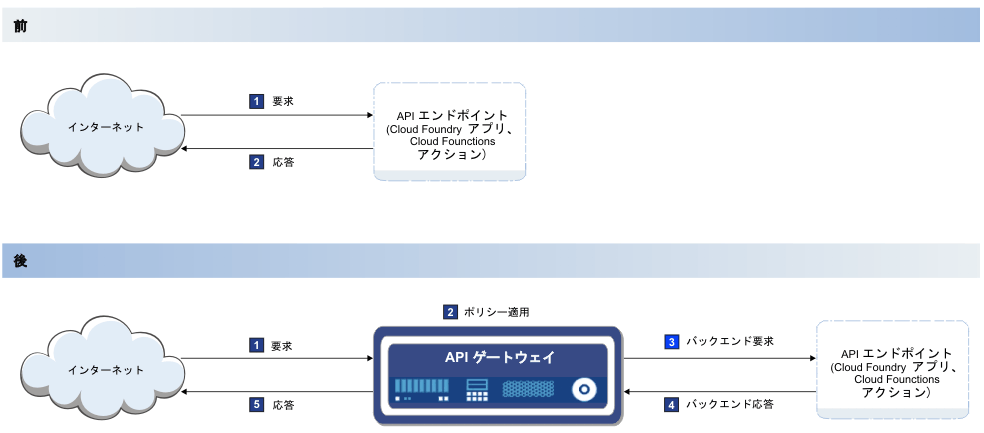

---

copyright:
  years: 2017,2018
lastupdated: "2018-07-02"

---

{:new_window: target="_blank"}
{:shortdesc: .shortdesc}
{:screen: .screen}
{:codeblock: .codeblock}
{:pre: .pre}

# 概説
{: #index}

API が Cloud Foundry ランタイムに関連付けられているか、{{site.data.keyword.openwhisk_short}} アクションに関連付けられているか、{{site.data.keyword.appconserviceshort}} サービスなどの統合 {{site.data.keyword.Bluemix_notm}} サービスの増大するリストに関連付けられているかに関わらず、{{site.data.keyword.Bluemix}} でネイティブに API を管理できます。 API を管理することで、使用量を制御したり、採用を増やしたり、統計を追跡したりすることができます。

API Management は、以下の {{site.data.keyword.Bluemix_notm}} サービスに統合されています。
* Cloud Foundry アプリケーション
* IBM App Connect
* {{site.data.keyword.openwhisk_short}} アクション API

以下の図に示すように、既存のクラウド・エンドポイントの前に高速かつ軽量なゲートウェイを挿入することによって、API Management が機能します。 ゲートウェイ (図では API ゲートウェイとして示されている) は、アプリケーションから着信した API 呼び出しへの応答を担当します。 API ゲートウェイは、セキュリティー、トラフィック管理、メディエーション、アクセラレーション、および非 HTTP プロトコルのサポートのための包括的な API ポリシー・セットを提供します。

API を公開するときに、その API を他のユーザーが使用できるようにします。 これは多くの場合、自分が保守するサーバー上にある情報に対する 限定されたアクセス権限を、API のユーザーに提供することを意味します。 現行のインターフェースから直接情報にアクセスできるため、このアクセス権限によって、よりシームレスなカスタマー・エクスペリエンスをエンド・ユーザーに提供できるようになります。

サーバー上のアクティビティーの一部を制御したい場合もあります。 例えば、短時間のうちにサーバー上に届いた API 要求が多すぎる場合、サーバーは過負荷になり、シャットダウンする可能性があります。 このような状況を回避するには、API Management を使用して API 呼び出しのレートを管理します。 API に接続された軽量なゲートウェイが API 呼び出しの回数を追跡し、受け入れる呼び出し回数の制限を適用します。 API Management では、API キーを記録することにより、特定のソースからの API 呼び出しのボリュームを追跡することもできます。 API キーは、API 開発チームが API を利用するチームに提供する固有のストリングであり、利用者チームの要求が生成する呼び出しに関する統計を、API 開発者がモニターできるようにします。  

{{site.data.keyword.Bluemix_notm}} API Management では、以下のフィーチャーが使用可能です。
## API 分析
{: #basic_analytics notoc}

API の使用を収益化したい場合は、分析フィーチャーを使用して呼び出しの使用量を追跡できます。 使用量をモニターすると、API がどのように使用されているかを理解することもできるため、採用を増やすためにどのように API を更新すればよいか、十分な情報を得た上で判断できます。

API について以下の統計を表示できます。
* 過去 1 時間または指定された時間間隔の応答数および平均応答時間。
* 1 分当たりの API 呼び出しの回数。
* 最後の 100 回の応答。

API Management では、{{site.data.keyword.Bluemix_notm}} のロギング・サービスおよびメトリック・サービスを使用して、API 呼び出し時に生成された情報を保管および表示します。 使用可能なデータのサブセットのみが、デバッグの目的で API Management コンソールに表示されます。 さらにデータおよびログ情報を表示するには、[『Kibana logs』](https://logging.ng.bluemix.net/app/#/kibana5){: new_window}を参照してください。 このリンクに、ご使用のアカウントで正しくアクセスするには、{{site.data.keyword.Bluemix_notm}} アカウントにログインしている必要があります。 {{site.data.keyword.Bluemix_notm}} ロギング・サービスについて詳しくは、『[モニターとロギング](../cli/monitoring_logging.html#monitoring_logging){: new_window}』を参照してください。

## サブスクリプション (API キー) ごとのレート制限
{: #rate_limit notoc}

アプリケーションが API を呼び出すことができる回数を管理するためにレート制限を適用できます。 1 秒、1 分、1 時間ごとに、許可される回数の呼び出しのみが実行されるように (例えばバックエンドが過負荷にならないように)、レート制限を指定できます。 このレートを API 全体に適用するように設定することも、各 API キーに個別に適用される API の単一の制限を設定することもできます。 キーおよび秘密について詳しくは、『[API 設定の編集](manage_apis.html#settings_apis)』を参照してください。

## OAuth
{: #oauth notoc}

提供するデータが、望まない使い方をされないように、正しい認証を持つユーザーのみが API にアクセスできるようにすることができます。 OAuth 許可標準を通じて API へのアクセスを制御できます。 OAuth は、ユーザーが個人情報を共有することなく、サード・パーティーの Web サイトやアプリケーションからユーザー・データにアクセスできるようにするトークン・ベースの許可プロトコルです。

## CORS
{: #cors notoc}

CORS を使用すると、Web ページの埋め込みスクリプトによって、ドメインの境界を越えて API を呼び出すことができます。 これにより、API は別のドメインを呼び出すとそのドメインから情報を取得できるようになるため、API のユーザーにとってメリットがあります。 CORS を有効にしなければ、コンテンツを取得できるのは、元の要求と同じドメインに限られます。 CORS およびその実装方法について詳しくは、[「Cross-Origin Resource Sharing (CORS)」 ](https://developer.mozilla.org/en-US/docs/Web/HTTP/CORS){: new_window} を参照してください。

## 追加の API Management オプション
{: #add_mgt_options notoc}

API Management 用のこれらのフィーチャーは、Cloud Foundry、{{site.data.keyword.openwhisk_short}}、または App Connect ダッシュボードの「API Management」タブで使用できます。 さらに複雑な管理ソリューションの場合は、完全な {{site.data.keyword.apiconnect_full}} サービスにアップグレードすると、詳細な分析、API のパッケージ化戦略、または API をソーシャル化する開発者ポータルなどの、追加的なフィーチャーを利用できます。 {{site.data.keyword.apiconnect_full}} サービスについて詳しくは、『[Getting started with API Connect](https://console.ng.bluemix.net/docs/services/apiconnect/index.html){: new_window}』を参照してください。

{{site.data.keyword.Bluemix_notm}} で管理している API を {{site.data.keyword.apiconnect_short}} サービスにアップグレードする方法について詳しくは、『[追加の API Management フィーチャーの利用](upgrade.html)』を参照してください。
